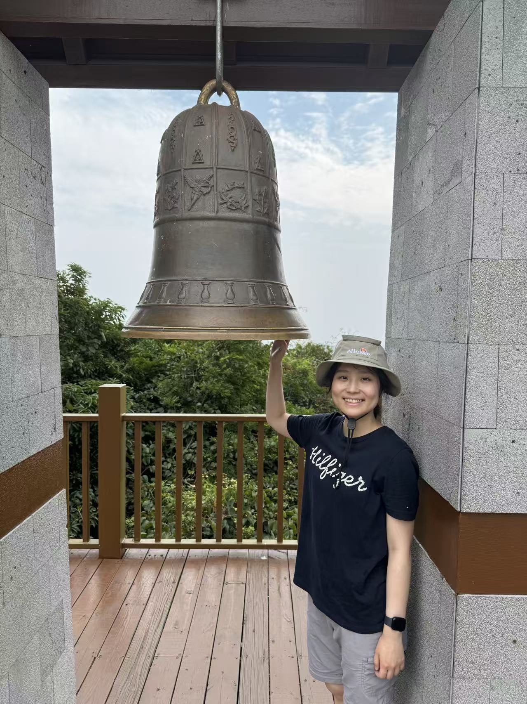

<!-- ===== Intro section with photo + text ===== -->

  <!-- Left: photo -->
  

    
  

  <!-- Right: text -->
  

  # Hello! My name is Yannan Pan.

  Cardiology · Electrophysiology · Atrial Fibrillation  
  Email: panyannan623@gmail.com

  ---

  ## About
  I'm an M.D. candidate from Peking University, majoring in internal medicine and cardiology.
  I received the Bachelor of Medicine degree in 2021 and finished internal medicine residency
  in 2024. Currently, I am undergoing cardiology fellowship training.

  ## Research Interests
  - Electrophysiology
  - Atrial fibrillation
  - ECG
  - Machine learning

  ## Selected Publications
  - **Pan, Y.**, Chen, E., Jie, S., Huo, D., Ding, Z., Zhou, J., Jiang, J., Li, J., & Huo, Y. (2025).  
    *Continuous atrial fibrillation monitoring using a wearable smartwatch: Using long-term Holter as reference.*  
    **Digital Health**, 11, 20552076251314105.  
    https://doi.org/10.1177/20552076251314105

  - Xia, Y., Jiang, J., Fan, F., **Pan, Y.**, Zhou, J., Zhang, Y., Li, J., Liu, J., Yang, N., Hao, Y., Zhao, D., Liu, J., Ma, C., Huo, Y., & CCC‐AF investigators (2024).  
    *Prevalence, Characteristics, and Treatment Strategy of Different Types of Heart Failure in Patients With Nonvalvular Atrial Fibrillation.*  
    **Journal of the American Heart Association**, 13(19), e033941.  
    https://doi.org/10.1161/JAHA.123.033941

  - He, P., **Pan, Y.**, Jiang, J., Fan, F., Zhou, J., Xia, Y., Liu, J., Yang, N., Hao, Y., Li, J., Liu, J., Zhao, D., Huo, Y., & CCC-AF investigators (2023).  
    *In-hospital therapies and determinants of treatment strategy selection in patients with atrial fibrillation and left ventricular systolic dysfunction in China.*  
    **BMJ Open**, 13(6), e070070.  
    https://doi.org/10.1136/bmjopen-2022-070070

  

